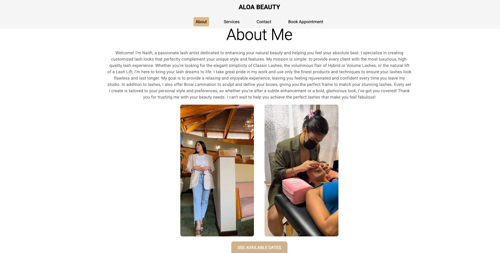
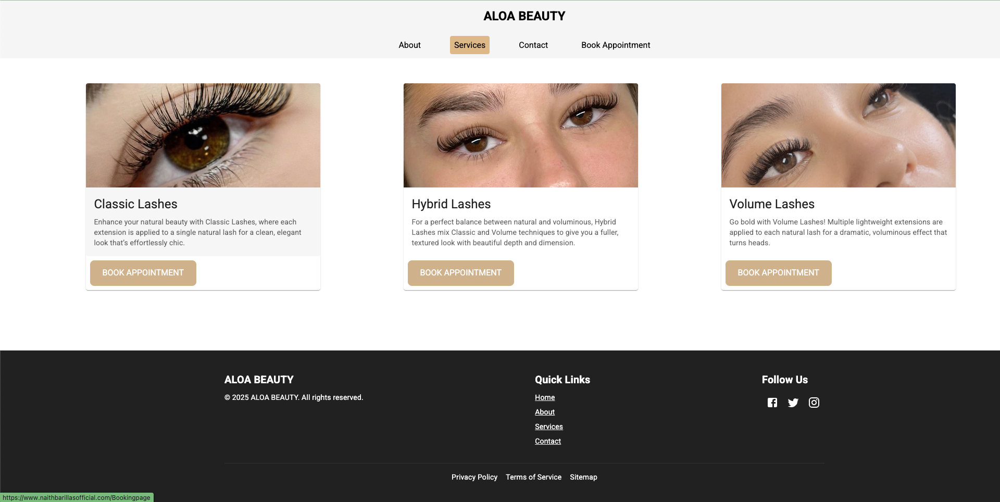
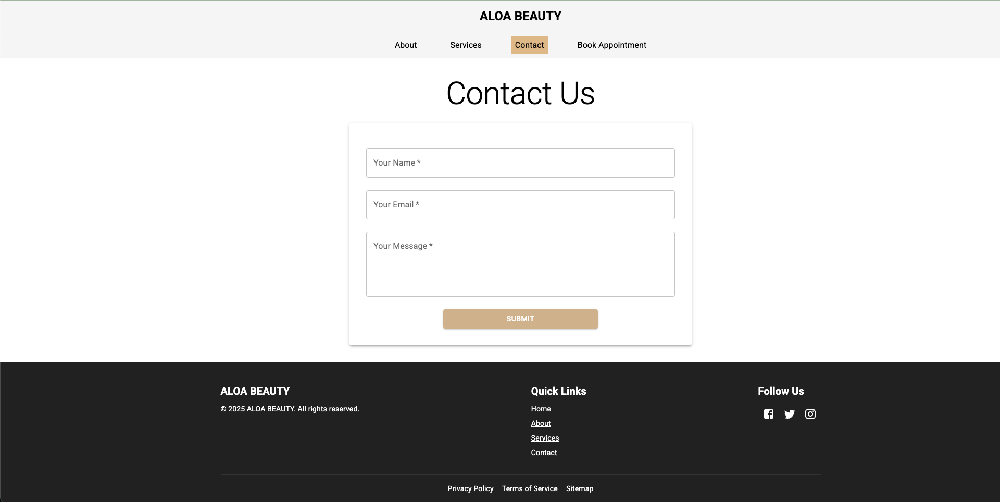
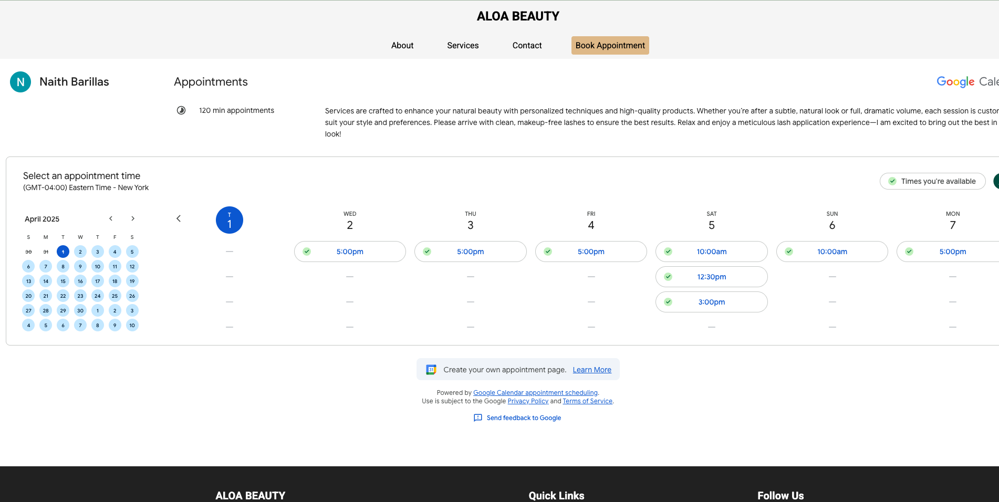

  
Cosmetology Booking App

A modern and mobile-friendly web application designed for cosmetology businesses, allowing clients to book available appointments seamlessly. The app integrates with the Google Calendar API to manage bookings efficiently.

🚀 Features

Clients can view available appointment slots and book in real-time

Seamless integration with Google Calendar API for scheduling

Mobile-friendly and responsive design

User-friendly interface for both clients and business owners

Notifications and reminders for upcoming appointments

🛠 Tech Stack

Frontend: React

API: Google Calendar API

Styling: Material UI

Package Manager: npm

📦 Installation

Clone the repository:

git clone https://github.com/yourusername/cosmetology-booking-app.git
cd cosmetology-booking-app

Install dependencies:

npm install

Set up Google Calendar API credentials:

Create an .env file and add your API key:

REACT_APP_GOOGLE_CALENDAR_API_KEY=your_api_key_here

Run the development server:

npm run dev

📸 Screenshots

🌟 Contributing

Pull requests are welcome! Please open an issue first to discuss any major changes.

📜 License

This project is licensed under the MIT License.

📬 Contact

For any questions or suggestions, feel free to reach out via GitHub Issues.

# React + Vite

This template provides a minimal setup to get React working in Vite with HMR and some ESLint rules.

Currently, two official plugins are available:

- [@vitejs/plugin-react](https://github.com/vitejs/vite-plugin-react/blob/main/packages/plugin-react/README.md) uses [Babel](https://babeljs.io/) for Fast Refresh
- [@vitejs/plugin-react-swc](https://github.com/vitejs/vite-plugin-react-swc) uses [SWC](https://swc.rs/) for Fast Refresh
